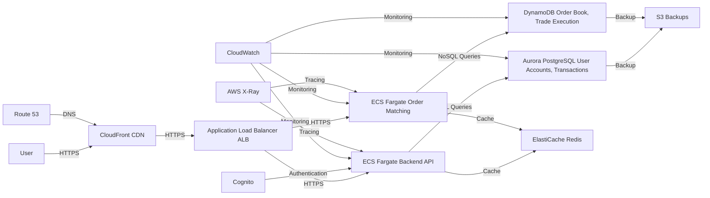

# Trading System Architecture

This project outlines the architecture for a **highly available, scalable, and cost-effective trading system** similar to Binance. It uses **AWS-native managed services** to minimize operational overhead while ensuring resilience and performance.

---

## Tech Stack

### Frontend
- **CloudFront (CDN)**: Delivers static assets (HTML, CSS, JS) with low latency.
- **Route 53**: DNS service to route traffic to the nearest CloudFront edge location.

### Backend
- **Application Load Balancer (ALB)**: Distributes incoming traffic across backend services.
- **ECS Fargate**: Hosts backend services in fully managed containers.
  - **Backend API**: Handles user requests (e.g., account management, order history).
  - **Order Matching**: Processes real-time buy/sell orders and executes trades.

### Databases
- **Aurora PostgreSQL**: Stores structured data like user accounts, balances, and transaction history.
- **DynamoDB**: Manages the real-time order book and trade execution.

### Caching
- **ElastiCache (Redis)**: Caches frequently accessed data (e.g., market prices, user sessions) to reduce database load.

### Authentication
- **Cognito**: Manages user authentication (OAuth, MFA) and integrates with Google/Okta.

### Monitoring & Tracing
- **CloudWatch**: Collects logs and metrics for all services.
- **AWS X-Ray**: Provides end-to-end tracing for API requests.

### Backup & Storage
- **S3**: Stores backups for Aurora PostgreSQL and DynamoDB.

---

## Architecture Diagram

## Why These Services?
### ECS Fargate
Fully managed: No need to manage EC2 instances.

Scalable: Automatically scales based on CPU/memory usage.

### Aurora PostgreSQL
High availability: Multi-AZ deployment ensures resilience.

ACID compliance: Ensures data integrity for financial transactions.

### DynamoDB
High throughput: Handles millions of requests per second.

Automatic scaling: Scales seamlessly with traffic.

### ElastiCache (Redis)
Reduces database load: Caches frequently accessed data.

Low latency: Improves response times for users.

### Cognito
Simplifies authentication: Integrates with Google/Okta for OAuth and MFA.

Cost-effective: Native to AWS with no additional licensing costs.

### CloudWatch & X-Ray
Native monitoring: Collects logs, metrics, and traces for all services.

Easy integration: Works seamlessly with other AWS services.

## Scaling Plan
### Immediate Scaling
* ECS Fargate: Auto Scaling based on CPU/memory usage.

* Aurora PostgreSQL: Read replicas for read-heavy workloads.

* DynamoDB: On-demand capacity for unpredictable traffic.

## Long-Term Growth
* Global Reach: Deploy to multiple regions with Route 53 latency-based routing.

* Database Sharding: Shard Aurora PostgreSQL and DynamoDB for larger datasets.

* Microservices: Break the backend into smaller services (e.g., user service, order service).

## Cost Optimization
* Use Fargate Spot for non-critical tasks.

* Use Aurora Serverless for variable SQL workloads.

## Deployment Steps
### Infrastructure Setup:

Use Terraform or AWS CloudFormation to provision resources (ECS, ALB, RDS, DynamoDB, etc.).

### Backend Deployment:

Deploy backend services to ECS Fargate using Docker containers.

### Database Configuration:

Set up Aurora PostgreSQL with Multi-AZ for high availability.

Configure DynamoDB tables with appropriate primary keys and indexes.

### Caching:

Set up ElastiCache (Redis) and integrate it with backend services.

### Authentication:

Configure Cognito for user authentication and integrate with Google/Okta.

### Monitoring:

Enable CloudWatch logging and metrics for all services.

Set up X-Ray for tracing API requests.

## Conclusion
This architecture leverages AWS-native managed services to build a scalable, resilient, and cost-effective trading system. By using ECS Fargate, Aurora PostgreSQL, and DynamoDB, you minimize operational overhead while ensuring high availability and performance. The Mermaid diagram and documentation provide a clear overview of the system and its components.